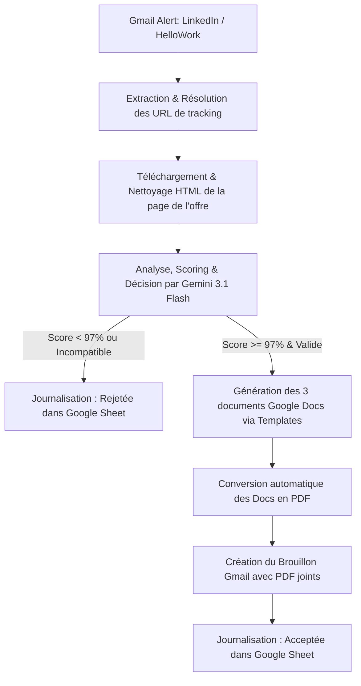

# HelloApply v6.1.0 🤖💼
### *Agent IA Autonome de Veille Technologique & Candidature Asymétrique*

**HelloApply** est un agent IA autonome conçu sous forme de micro-service résilient pour Google Apps Script. Il surveille votre boîte de réception Gmail en continu, intercepte les alertes de postes en provenance de **LinkedIn** et **HelloWork**, analyse leur pertinence en temps réel avec le LLM **Gemini 3.1 Flash-Lite**, et génère automatiquement un dossier de candidature sur-mesure (CV, Lettre de motivation, et Mémo technique d'architecture) au format PDF sur Google Drive, prêt à l'envoi sous forme de brouillon Gmail.

---

## 🎯 Objectif et Vision du Projet

Dans un marché du recrutement hautement concurrentiel et dominé par les filtres ATS (Applicant Tracking Systems), les candidatures génériques ne suffisent plus. L'objectif de **HelloApply** est de renverser le rapport de force en réalisant des **candidatures asymétriques de haute précision** :

1. **Automatisation de la Veille** : L'agent élimine la tâche chronophage de tri manuel en analysant automatiquement chaque offre reçue par e-mail (LinkedIn & HelloWork) à la seconde près.
2. **Filtrage Intelligent à Haute Sélectivité** : Grâce à une analyse sémantique avancée, l'agent calcule un score d'adéquation (seuil fixé à **97%** en production). Il élimine instantanément les postes juniors, géographiquement incompatibles (hors télétravail/Full Remote depuis Lorient), ou n'offrant pas de défis techniques à la hauteur d'un profil Senior (30+ ans d'expérience).
3. **Candidature Asymétrique Instantanée** : Pour chaque offre validée, l'agent produit en moins de 60 secondes un dossier d'une qualité technique irréprochable, rédigé dans la langue de l'offre (Français ou Anglais), composé de :
   * 📄 **Un CV ATS-Compliant** : Restructuré comme un index dynamique de preuves de travail et de projets exécutables (valorisant l'expertise en IA Agentique, architectures distribuées, et la suite haute performance **Episteme** / **Eternity**).
   * ✉️ **Une Lettre de Motivation Premium** : Construite sur une structure narrative captivante de type "You, Me, Us".
   * 💡 **Un Mémo d'Architecture Technique** : Document peer-to-peer rédigé au niveau du CTO/Directeur Technique, analysant et résolvant virtuellement les goulots d'étranglement et la dette technique de l'entreprise ciblée.
4. **Préparation du Brouillon Gmail** : L'agent compile les documents en PDF, les joint à un brouillon Gmail prêt à être envoyé par l'utilisateur, et consigne la candidature dans un Google Sheet de suivi centralisé.

---

## 🔄 Chaîne Opératoire (Workflow Interne)



Pour plus de détails techniques sur les diagrammes de séquence et l'architecture, consultez notre **[Document d'Architecture Technique complet](architecture.md)**.

---

## 📁 Préparation de la Structure Google Drive

Avant d'installer le script, vous devez préparer vos dossiers et modèles sur Google Drive.

1. **Créer le Dossier Racine** : Créez un dossier nommé exactement `Candidature Express` à la racine de votre Google Drive.
2. **Créer les Sous-Dossiers** : À l'intérieur de `Candidature Express`, créez deux dossiers :
   * `input` : Contiendra vos documents de référence et modèles.
   * `output` : Le script y générera les dossiers de candidatures, les fichiers PDF et le tableur de suivi.
3. **Importer vos Modèles (dans le dossier `input/`)** :
   * **Le CV Source (Texte Complet)** : Importez un document Google Docs nommé `SilvereMartinMichiellot-CV-full`. Il doit contenir l'intégralité de vos expériences et compétences (votre base de connaissances).
   * **Le Modèle de CV (Mise en Page)** : Importez un document Google Docs nommé `SilvereMartinMichiellot-CV-1pageATS-2026` contenant votre structure de mise en page de CV vierge (styles, couleurs, polices calibrées pour l'ATS).
   * **Le Modèle de Lettre & Mémo** : Importez un document Google Docs nommé `Lettre de motivation Silvère Martin-Michiellot 2026b` servant de base graphique pour les lettres et mémos techniques.

---

## ⚙️ Guide d'Installation Étape par Étape

### Étape 1 : Clonage et Configuration Locale
Clonez le dépôt sur votre machine de développement et installez l'outil de synchronisation Google `clasp` :

```bash
# 1. Cloner le dépôt
git clone https://github.com/silveremartin-dev/HelloApply.git
cd HelloApply

# 2. Installer clasp globalement
npm install -g @google/clasp
```

### Étape 2 : Connexion à Google Apps Script
Activez l'API Google Apps Script sur votre compte Google en visitant [https://script.google.com/home/usersettings](https://script.google.com/home/usersettings) et en activant le bouton. Ensuite, connectez-vous localement :

```bash
clasp login
```
*Une fenêtre de navigateur s'ouvrira pour vous demander d'autoriser clasp à accéder à votre compte Google.*

### Étape 3 : Fichier de Configuration `.clasp.json`
Assurez-vous que le fichier `.clasp.json` à la racine contient le bon identifiant de votre projet Apps Script (`scriptId`) :
```json
{
  "scriptId": "VOTRE_SCRIPT_ID_APPS_SCRIPT",
  "rootDir": "."
}
```

### Étape 4 : Configuration des Secrets
Créez un fichier nommé **`Secrets.gs`** à la racine de votre projet local. Ce fichier contiendra vos clés privées et ne sera jamais poussé sur Git (exclu par `.gitignore`) :

```javascript
// Secrets.gs
const GEMINI_API_KEY = "VOTRE_CLE_API_GEMINI_ICI";
```

### Étape 5 : Déploiement via Clasp
Grâce au fichier de configuration `.claspignore` déjà configuré à la racine, clasp ne poussera **que** les fichiers nécessaires à la production (`Code.gs`, `Secrets.gs`, `Debug.gs`, `appsscript.json`) et ignorera automatiquement vos scripts de tests locaux Node.js ou Python :

```bash
clasp push
```

---

## 🚀 Lancement & Automatisation

Une fois le code poussé en ligne :

### 1. Premier Lancement et Autorisations
1. Ouvrez votre éditeur Google Apps Script en ligne.
2. **Très Important : Actualisez l'onglet de votre navigateur (F5)** si celui-ci était déjà ouvert, afin de charger la nouvelle arborescence propre.
3. Dans la liste déroulante des fonctions, sélectionnez `main` et cliquez sur **Exécuter**.
4. Lors du premier lancement, Google affichera une boîte de dialogue d'autorisation. Cliquez sur **Paramètres avancés** puis sur **Accéder à HelloApply (autoriser)** pour accorder au script les droits d'accès à Gmail, Drive, Docs et Sheets.

### 2. Planification du Déclencheur Automatique (Trigger)
Pour que l'agent travaille en arrière-plan de manière totalement autonome sans aucune action de votre part :
1. Dans l'éditeur Apps Script, sélectionnez la fonction `setupTriggers` et cliquez sur **Exécuter**.
2. Cette fonction va configurer automatiquement un déclencheur horaire permanent.
3. L'agent se réveillera désormais toutes les heures, scannera vos nouveaux e-mails de la dernière heure, et générera vos candidatures en tâche de fond.

---

## 🛡️ Le Bouclier de Production Anti-Saturation

Le script intègre un système de protection multi-niveaux pour garantir un fonctionnement stable et gratuit en production sans jamais dépasser les quotas de Google ou de l'API Gemini :

* 🎯 **Haute Sélectivité (`MIN_MATCH_SCORE = 97`)** : L'agent cible uniquement l'excellence. Seuls les profils d'offres quasi-parfaits déclenchent la génération lourde.
* 🛑 **Cap de Génération Strict (`MAX_GENERATIONS_PER_RUN = 3`)** : Le script ne génère jamais plus de 3 candidatures complètes par passage horaire pour éviter la saturation réseau ou de l'API. Les offres en attente seront traitées au passage suivant grâce au suivi de déduplication permanent.
* ⏱️ **Régulation du Débit (Throttling)** : Une pause de sécurité de 2 secondes est observée après le traitement de chaque offre pour lisser la charge.
* 🔄 **Retry avec Exponential Backoff** : La fonction `callGemini` gère intelligemment les erreurs de surcharge temporaire de l'API (HTTP 503/429) en retentant l'appel automatiquement jusqu'à 3 fois avec un temps d'attente exponentiel.
* ⚡ **Coupe-Circuit Temporel (`exitRequested`)** : Si le script approche de la limite de temps Apps Script de 6 minutes, il s'interrompt proprement en sauvegardant l'état pour reprendre sans erreur au prochain passage.

---

## 🔒 Sécurité & Confidentialité
* Le fichier `.claspignore` empêche la fuite accidentelle de clés d'API ou de scripts de débogage locaux.
* Le script ne marque pas vos e-mails comme "lus" et ne supprime rien. Les brouillons Gmail générés restent à l'état de brouillon, vous laissant le contrôle final absolu avant envoi.
