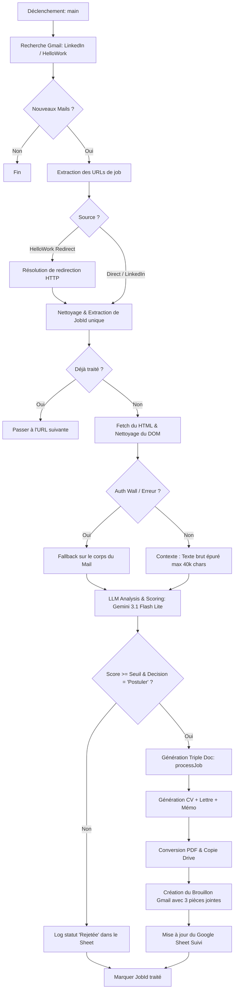

# Architecture Technique & Chaîne Opératoire — HelloApply 🤖💼

Ce document détaille le fonctionnement interne, le flux opérationnel (chaîne opératoire), les choix de conception, et l'architecture technique du système autonome **HelloApply**.

---

## 📌 1. Vue d'Ensemble & Objectif

**HelloApply** est un agent de candidature asymétrique autonome à haute performance. Contrairement aux approches de candidature de masse simplistes, HelloApply fonctionne comme un **Principal Engineer virtuel** :
1. Il identifie les opportunités à forte valeur ajoutée.
2. Il diagnostique la dette technique ou les frictions potentielles de l'entreprise cible à partir de la description du poste.
3. Il formule une posture d'autorité technique de pair-à-pair à travers **trois documents distincts** (CV ultra-ciblé, Lettre classique "You-Me-Us", et Mémo d'architecture technique flash).

---

## 🔄 2. La Chaîne Opératoire (Workflow Opérationnel)

Voici le cycle de traitement de bout en bout exécuté de manière planifiée ou manuelle :

### Étape 2.1 : Capture & Résolution (Gmail & Network Engine)
* **Recherche sélective** : Le script interroge Gmail pour cibler spécifiquement les alertes en provenance de LinkedIn et HelloWork (`subject:"nouvelles offres"`, `from:jobalerts-noreply@linkedin.com`, etc.).
* **Résolution des redirections** : Les emails HelloWork contiennent des liens de clic-tracking chiffrés (`emails.hellowork.com/clic/...`). Le module `resolveRedirects` émule des requêtes HTTP séquentielles (jusqu'à 5 rebonds) sans suivre automatiquement les redirections pour intercepter le header `Location` final. Si l'adresse est invalide ou inaccessible, le script l'ignore proprement sans planter le workflow.
* **Déduplication robuste** : Chaque job possède un identifiant unique extrait de l'URL finale. Le statut est enregistré dans le `PropertiesService` de Google Apps Script pour éviter tout traitement doublon.

### Étape 2.2 : Extraction & Décontamination (DOM Stripping)
* Le HTML de la page d'offre est récupéré via `UrlFetchApp`.
* Pour contourner les overlays de type cookie walls (comme celui de HelloWork qui consomme des milliers de caractères), le script nettoie agressivement les balises `<script>` et `<style>`, supprime l'ensemble des balises HTML et compresse les espaces blancs superflus.
* **Fenêtre d'analyse large** : La limite de capture a été étendue de 8 000 à **40 000 caractères**. Cela garantit que la description de l'offre (généralement située sous les éléments de navigation lourds) n'est jamais tronquée, tout en restant très largement dans la fenêtre de contexte de Gemini.

### Étape 2.3 : Analyse cognitive & Matching (LLM Engine)
* Le texte nettoyé est envoyé à Gemini avec le **Master CV** complet et des instructions strictes.
* **Location-Based Cut-off** : Le système applique automatiquement un coupe-circuit géographique. Si le poste requiert une présence sur site en dehors du secteur de Lorient et n'est pas explicitement étiqueté "Full Remote", le score est forcé à `0` et la décision à `"Ignorer"`.
* **Rappels anti-hallucination** : Des balises rigides `<tone_reference_only>` encadrent les CV d'exemples dans le prompt pour empêcher le LLM de recopier des données fictives (dates, noms d'entreprises de démo).

### Étape 2.4 : Génération & Mise en Page (Rendering Pipeline)
Si le score de match dépasse le seuil minimal (85% en production, 95% en mode test), la fonction `processJob()` orchestre la génération asymétrique :
1. **CV personnalisé (1 ou 2 pages)** : restructuré selon les besoins du poste en valorisant les projets open-source phares de l'écosystème de Silvère (**Episteme**, **Eternity**, **Swarm Forge**, **Open Primer**, **Antigravity**).
2. **Lettre de motivation classique** : structure d'accroche premium et personnalisation fine.
3. **Mémo d'architecture technique** : document hautement technique, sans formule de subordination, ciblant directement les goulets d'étranglement de l'entreprise cible (mise à l'échelle d'agents IA, parallélisation de solveurs, architecture de systèmes complexes distribués).

---

## 🛠️ 3. Architecture Technique des Composants

### 3.1 Orchestration Google Apps Script (`Code.gs`)
* **`main()`** : Point d'entrée principal. Gère la détection du mode (`TEST_MODE`), la récupération des e-mails, et l'orchestration globale.
* **`fetchJobDescription()`** : Agent HTTP avec usurpation de `User-Agent` moderne et nettoyage regex du DOM.
* **`resolveRedirects()`** : Résolveur de redirects de tracking robuste avec gestion automatique des erreurs réseau.
* **`analyzeAndTailor()`** : Interface d'appel à l'API Gemini. Structure la requête en format JSON strict.

### 3.2 Moteur de Rendu Documentaire (`renderMarkdownToDoc`)
Le script implémente son propre parseur de Markdown vers Google Docs :
* **ATS Layout Standard** : Marges réduites (24pt haut/bas, 36pt gauche/droite) pour optimiser l'espace vertical.
* **Reset d'héritage de styles** : Nettoie et réinitialise de manière déterministe les attributs de texte (taille de police, graisses, polices, couleurs) à chaque transition de paragraphe ou d'élément de liste pour éviter que les styles de titre ne bavent sur le corps du texte.
* **Formatage intelligent des liens** : Détecte dynamiquement les liens GitHub, LinkedIn et adresses e-mail pour leur appliquer un style hyperlien premium uniforme (bleu `#2B6CB0`, souligné, cliquable).
* **Gestion des sauts de page orphelins** : Suppression des sauts de page arbitraires complexes au profit d'un ajustement fin du `SPACING_BEFORE` et de la taille de police pour maximiser la compacité sans introduire de pages blanches artificielles.

---

## 🛡️ 4. Standards ATS Intégrés (Filtres Robots)

Les documents générés respectent rigoureusement les contraintes de parsing des ATS (Applicant Tracking Systems) modernes :
* **Structure mono-colonne stricte** : Pas de tableaux complexes, pas de zones de texte flottantes ou de graphiques qui perturbent l'ordre de lecture linéaire des parsers automatiques.
* **Puces standardisées** : Utilisation exclusive du type de puce ronde native de Google Docs.
* **Pas de sections orphelines** : Les titres (`##` et `###`) sont liés au contenu pour ne jamais se retrouver isolés en bas de page.
* **Nettoyage programmé des entêtes** : Les informations de contact indispensables (Nom, Téléphone, E-mail, LinkedIn) sont injectées au tout début du corps du texte et non dans les sections `Header`/`Footer` natifs du document, qui sont souvent invisibles pour les robots ATS.

---

## 🔧 5. Maintenance & Variables de Contrôle

Toutes les configurations clés se trouvent au sommet de `Code.gs` :
* `TEST_MODE` : Activé par défaut pour limiter le traitement à **1 LinkedIn + 1 HelloWork** hautement qualifiés (seuil strict à 95%) pour les tests de robustesse sans surconsommer le quota d'API.
* `MIN_MATCH_SCORE` : Seuil de pertinence de postulation automatique en production (85%).
* `PREFERENCES` : Domiciliation physique de référence et rayon géographique de déplacement.
